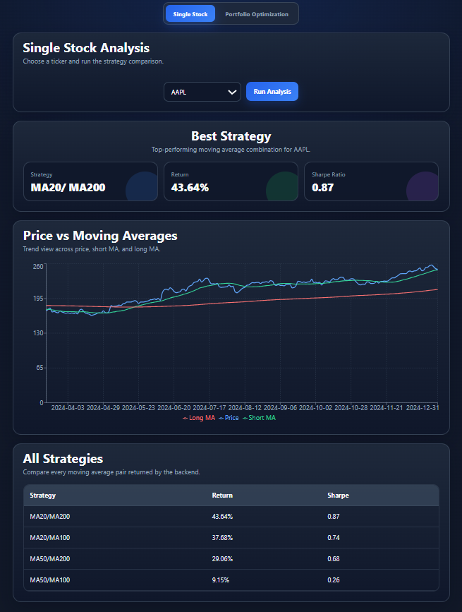
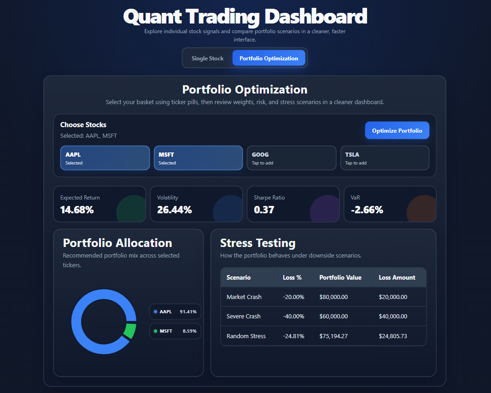
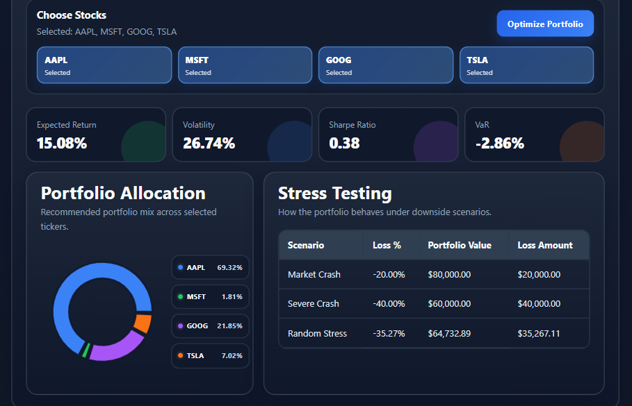

# Quant Trading Dashboard

A full-stack quantitative trading and portfolio analytics platform built using React, FastAPI, and Python.

The platform enables users to analyze individual stocks, backtest systematic trading strategies, optimize portfolio allocations, and evaluate portfolio risk through Value-at-Risk (VaR) and stress testing methodologies.

---

## Features

### Single Stock Analysis

* Historical market data retrieval
* Moving Average Crossover Strategy
* Strategy Parameter Optimization
* Backtesting Engine
* Return Analysis
* Sharpe Ratio Evaluation
* Interactive Price vs Moving Average Visualization
* Strategy Performance Comparison

### Portfolio Optimization

* Multi-Asset Portfolio Construction
* Monte Carlo Portfolio Optimization
* Maximum Sharpe Ratio Portfolio Selection
* Portfolio Return Analysis
* Portfolio Volatility Analysis
* Portfolio Allocation Dashboard

### Risk Analytics

* Historical Value-at-Risk (VaR)
* Market Crash Stress Testing
* Severe Crash Stress Testing
* Randomized Scenario Analysis

---

## Dashboard Preview

## Single Stock Strategy Analysis



## Portfolio Optimization Dashboard



## Risk Analytics Dashboard



---

## Technology Stack

### Frontend

* React
* Axios
* Recharts
* CSS

### Backend

* FastAPI
* Python

### Data & Analytics

* Pandas
* NumPy
* yFinance

---

## System Architecture

User Interface (React)

↓

REST API Layer (FastAPI)

↓

Analytics Engine

↓

Strategy Backtesting

Portfolio Optimization

Risk Analytics

↓

Market Data Processing

---

## Project Structure

Trading-Platform/

├── frontend/

│   ├── src/

│   ├── App.jsx

│   └── App.css

│

├── backend/

│   └── main.py

│

├── src/

│   ├── analyze.py

│   ├── optimizer.py

│   ├── portfolio_optimizer.py

│   ├── strategy.py

│   ├── backtester.py

│   ├── metrics.py

│   ├── risk_metrics.py

│   ├── stress_test.py

│   └── data_loader.py

---

## Installation

### Backend

```bash
cd backend

pip install -r requirements.txt

python -m uvicorn main:app --reload
```

### Frontend

```bash
cd frontend

npm install

npm run dev
```

---

## Portfolio Optimization Methodology

The portfolio optimization engine uses Monte Carlo simulation to generate thousands of random portfolio allocations.

For each simulated portfolio:

1. Expected annual return is calculated.
2. Portfolio volatility is estimated.
3. Sharpe ratio is computed.
4. The portfolio with the highest Sharpe ratio is selected as the optimal allocation.

---

## Risk Analytics

### Value-at-Risk (VaR)

Historical simulation is used to estimate downside portfolio risk at a specified confidence level.

### Stress Testing

The platform evaluates portfolio performance under multiple adverse market conditions:

* Market Crash (-20%)
* Severe Crash (-40%)
* Randomized Asset Stress

---

## Future Improvements

* Efficient Frontier Visualization
* Portfolio Allocation Pie Charts
* PDF Report Generation
* Additional Trading Strategies
* Machine Learning-Based Signal Generation
* Live Market Data Integration

---

## Author

Developed by Noop as a quantitative finance and full-stack analytics project.
